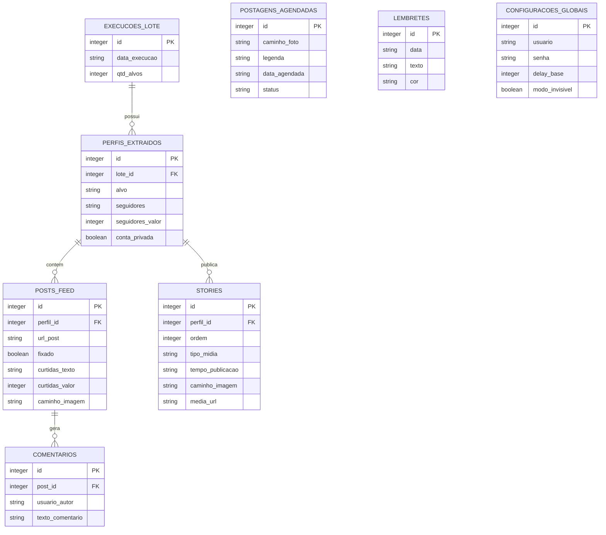

# Documentação Técnica: AutPost (Instagram Monitor Pro)

O AutPost é um sistema completo desenvolvido em Python para automação, monitoramento e extração de dados da plataforma Instagram. Esta documentação abrange o funcionamento interno, arquitetura, e estrutura do banco de dados para auxiliar no desenvolvimento contínuo e manutenção.

---

## 1. Arquitetura do Sistema

O sistema utiliza uma arquitetura modularizada em camadas, separando as responsabilidades de extração de dados, armazenamento, agendamento de tarefas e interface visual.

- **Frontend (Painel de Controle e Calendário):** Interface visual construída com HTML5 e estilizada com Tailwind CSS + Vanilla CSS. O Javascript foi **completamente refatorado em Módulos ES6** (`dashboard.js`, `scraper.js`, `modals.js`, `agendamentos.js`, `calendar.js`, `dragDrop.js`, `toast.js`, `ui.js`, `config.js`, `globals.js`, `lembretes.js`) orquestrados pelo arquivo `main.js`. Permite interações ricas como **Drag & Drop**, gestão do calendário de posts, acompanhamento ao vivo via polling e sistema de **Notificações Toast** não-obstrutivas. Utiliza **cache-busting por versão** (`?v=X.0`) nos imports para evitar problemas de cache agressivo do navegador.
- **Backend (API FastAPI):** O arquivo `main.py` hospeda o servidor Uvicorn. Provê todas as rotas de API RESTful para operação dos scripts, CRUD no banco de dados e manipulação de arquivos estáticos. Inclui endpoint dedicado `/api/perfis` para listar todos os perfis já extraídos.
- **Motor de Extração (Scraper Feed):** Módulo `scraper.py` contendo as rotinas em Selenium para acessar o Instagram, driblar pop-ups e extrair dados do feed usando estratégias de tolerância a falhas.
- **Motor de Extração (Scraper Stories):** Módulo `scraper_stories.py` dedicado à extração de stories. Implementa **deduplicação inteligente**: antes de capturar um screenshot, verifica no banco se a `media_url` (src da mídia) já foi registrada. Se já existir, reutiliza o print anterior, evitando arquivos duplicados na pasta `prints/`.
- **Gerenciador de Trabalhos em Segundo Plano (O Vigia):** Implementado no `main.py` utilizando `APScheduler`. Acorda periodicamente (a cada 1 minuto) e checa a fila de postagens pendentes no banco.

---

## 2. Módulos e Funcionalidades

### main.py (O Cérebro)
Ponto de entrada do projeto. Inicia a FastAPI e carrega middlewares CORS.
- Gerencia o "estado ativo" do painel via polling (`/api/status_tarefa`).
- Recebe requisições de extração via IDs de Tarefa únicos (`task_id`) e executa em thread paralela (`asyncio.to_thread`).
- Servir arquivos estáticos (`/fotos`, `/uploads`, `/frontend`).
- **Rotas analíticas:** `/api/perfis`, `/api/historico_graficos`, `/api/stories/{perfil}`, `/api/historico_detalhado/{perfil}`.

### scraper.py (Extração do Feed)
Funções baseadas em Selenium WebDriver.
- **rodar_robo**: Orquestra toda a extração (Login → Acessar Alvo → Extrair Perfil → Seguidores → Posts → Curtidas/Comentários).
- **Proteção de RAM (aniquilar_processo_chrome)**: Destrói processos filhos do Chrome que falham ao encerrar.
- **Limitações de Segurança:** Configurável via interface (limite de posts, tempos de espera, modo headless).

### scraper_stories.py (Extração de Stories)
Módulo dedicado à captura de stories com deduplicação.
- **_extrair_media_url**: Extrai a URL da mídia (`src` da `` ou `<video>`) do DOM como identificador único.
- **_capturar_print_story**: Localiza o elemento de mídia no DOM e faz screenshot isolado.
- **extrair_stories_perfil**: Orquestra a extração percorrendo todos os stories ativos. Antes de capturar, consulta `buscar_print_story_existente()` no banco. Se o print já existe, reutiliza o arquivo sem criar duplicata.
- **Logs descritivos:** Exibe no terminal `♻️ Reutilizando print existente` ou `📸 Novo print capturado`.

### database.py (Camada de Dados)
Implementado em SQLite3 com `PRAGMA foreign_keys = ON`.
- `conectar()`: Context Manager seguro para conexões.
- `buscar_todos_perfis()`: Retorna todos os perfis únicos já extraídos (alimenta o dropdown dinâmico).
- `buscar_stories_por_perfil()`: Deduplicação inteligente por `media_url` (GROUP BY). Stories legado (sem `media_url`) retornam apenas da extração mais recente. Inclui campo `vezes_visto` contando capturas.
- `buscar_print_story_existente()`: Verifica se já existe um print para uma `media_url`, incluindo checagem de existência do arquivo no disco.
- `obter_ranking_horarios()`: Análise de dias da semana com maior engajamento.

### Frontend JS (Módulos ES6)

| Arquivo | Responsabilidade |
|---|---|
| `main.js` | Ponto de entrada, orquestra imports com cache-busting |
| `dashboard.js` | Dashboard de crescimento, gráficos, galeria de stories/posts, dropdown dinâmico |
| `scraper.js` | Interface da extração em tempo real, cards de resultado |
| `modals.js` | Sistema de modais customizados (substituindo `alert()`/`confirm()` nativos) |
| `agendamentos.js` | CRUD de agendamentos de posts |
| `calendar.js` | Calendário de conteúdo |
| `dragDrop.js` | Drag & Drop de agendamentos e lembretes |
| `toast.js` | Notificações toast (sucesso/erro/info) |
| `ui.js` | Navegação de abas, UI geral |
| `config.js` | Configurações globais |
| `globals.js` | Constantes, utilitários de data |
| `lembretes.js` | CRUD de lembretes |

### meta_api.py (Integrações Externas)
Conector com a API Graph do Facebook/Instagram (v19.0).
- Publicação em duas fases (Container Request → Publish Request).
- Modo Simulação quando não há Super Token válido.

### utils.py (Ferramentas Menores)
- **analisar_curtidas(texto)**: Converte textos do Instagram ("1,5 mi", "240 mil") em valores numéricos.
- **sleep_seguro()**: Sleep interruptível que permite cancelamento instantâneo.

---

## 3. Diagrama do Banco de Dados (Entidade-Relacionamento)

O banco de dados (SQLite `banco_dados.db`) utiliza relações com exclusão em cascata (`ON DELETE CASCADE`).



---

## 4. Fluxograma de Execução (Modo Scraper)

1. Usuário configura credenciais na aba "Configurações Globais".
2. Usuário clica em "Iniciar Extração", enviando um `task_id`.
3. O servidor executa `scraper.py` (feed) e/ou `scraper_stories.py` (stories) em thread assíncrona.
4. O Frontend faz polling a cada 1 segundo via `/api/status_tarefa/{task_id}`.
5. O Selenium navega de forma oculta ou visível (Headless), extrai dados para memória.
6. **Para stories:** Antes de capturar screenshot, verifica deduplicação por `media_url`.
7. Se não cancelado, salva tudo via `database.salvar_lote()` em transação única.
8. Backend envia status "100%", Frontend renderiza os dados e atualiza gráficos/galeria.

---

## 5. Deduplicação de Stories

O sistema implementa deduplicação inteligente de screenshots para evitar acúmulo de arquivos repetidos:

```
Story exibido no navegador
    ↓
Extrai a URL da mídia (src da  ou <video>)
    ↓
Consulta o banco: "Já existe um print com essa media_url?"
    ├─ SIM → Reutiliza o caminho_imagem existente (sem novo screenshot)
    └─ NÃO → Tira o screenshot normalmente e salva
    ↓
Salva no banco COM a media_url para futuras consultas
```

A galeria de stories exibe cada story **uma única vez**, com um badge "Nx visto" indicando quantas vezes foi capturado. Stories legados (antes da deduplicação) mostram apenas os da extração mais recente.

---

## 6. Como Contribuir e Modificar

- **Adicionar Coluna Nova de Raspagem:** Adicione o extrator XPath no `scraper.py` ou `scraper_stories.py`. Inclua ao dicionário retornado e ao insert SQL no `database.py`. Use `ALTER TABLE` com `try/except` na `criar_tabelas()` para migração automática.
- **Modificar Frontend:** Edite o módulo JS correspondente em `frontend/js/`. Os estilos visuais ficam em `frontend/css/style.css` e o esqueleto em `index.html`. **Lembre-se de incrementar a versão** nos imports de `main.js` e na tag `<script>` de `index.html` para quebrar o cache.
- **Criar Novos Gráficos:** Implemente um getter SQL em `database.py` e atualize o ChartJS em `dashboard.js`.
- **Adicionar Novo Perfil:** Perfis são adicionados automaticamente ao banco na primeira extração e aparecem no dropdown do dashboard via `/api/perfis`.
