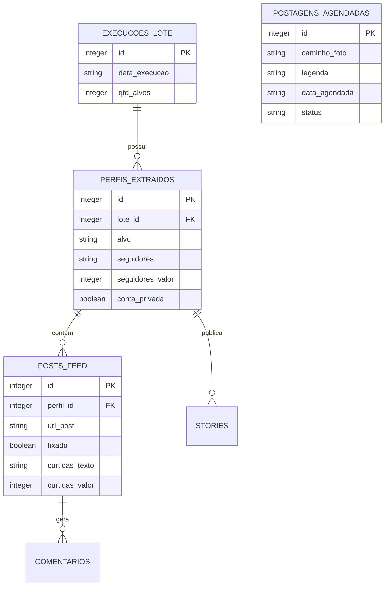

# Documentação Técnica: AutInsta (Instagram Monitor Pro)

O AutInsta é um sistema completo desenvolvido em Python para automação, monitoramento e extração de dados da plataforma Instagram. Esta documentação abrange o funcionamento interno, arquitetura, e estrutura do banco de dados para auxiliar no desenvolvimento contínuo e manutenção.

---

## 1. Arquitetura do Sistema

O sistema utiliza uma arquitetura modularizada em camadas, separando as responsabilidades de extração de dados, armazenamento, agendamento de tarefas e interface visual.

- **Frontend (Painel de Controle e Calendário):** Interface visual construída com HTML5 e estilizada com utilitários CSS e Vanilla CSS. O Javascript, inicialmente monolítico, foi **completamente refatorado em Módulos ES6** (ex: `api.js`, `calendar.js`, `modals.js`, `dragDrop.js`) orquestrados pelo arquivo `main.js`. Isso traz robustez de produção e facilita a manutenção. Permite interações ricas como **Drag & Drop** de ideias para o calendário, gestão do **Hub do Dia** (modal centralizador de tarefas diárias), acompanhamento ao vivo via polling e sistema de **Notificações Toast** amigáveis e não-obstrutivas.
- **Backend (API FastAPI):** O arquivo `main.py` hospeda o servidor Uvicorn. Ele provê todas as rotas de API RESTful para que o painel consiga operar os scripts em Python por debaixo dos panos, gerenciar o CRUD no banco de dados e manipular arquivos estáticos de upload.
- **Motor de Execução (Scraper):** Módulo `scraper.py` contendo as rotinas em Selenium para acessar a versão Web do Instagram, driblar pop-ups e extrair dados usando estratégias de tolerância a falhas. Conta com otimizações de fluxo (ex: navegação direta para URLs de Stories quando solicitados de forma isolada, poupando carregamentos desnecessários).
- **Gerenciador de Trabalhos em Segundo Plano (O Vigia):** Implementado no `main.py` utilizando `APScheduler`. Esta entidade invisível acorda periodicamente (ex: a cada 1 minuto) e checa a fila no Banco de Dados para efetuar postagens na Meta API.

---

## 2. Módulos e Funcionalidades

### main.py (O Cérebro)
Ponto de entrada do projeto. Inicia a FastApi e carrega middlewares CORS para permitir integração Frontend-Backend.
- Gerencia o "estado ativo" do painel de administração via polling adaptado (rotas `/api/status_tarefa`).
- Recebe e isola requisições de execuções de Bots via IDs de Tarefa únicos (`task_id`). Quando acionado, executa a varredura (`scraper.py`) numa thread paralela (`asyncio.to_thread`) para não travar o backend, permitindo também o cancelamento assíncrono.
- Lida com a montagem das pastas locais `/fotos`, `/uploads` e servir os arquivos estáticos (`/frontend/css`, `/frontend/js`).

### scraper.py (O Moto-Scraper)
Funções baseadas em Selenium Webdriver.
- **rodar_robo**: Orquestra todo o fluxo de uma extração (Login -> Acessar Alvo -> Extrair Perfil -> Extrair Dados de Seguidores -> Clicar nos Posts -> Varredura de Fotos, Curtidas e Comentários).
- **Proteção de RAM (aniquilar_processo_chrome)**: Função vital que destrói ativamente processos filhos do Google Chrome que falham ao ser encerrados, prevenindo o congelamento de servidores VPS por estouro de memória.
- **Limitações de Segurança:** O bot é configurado via interface (limite de posts, tempos de espera, modo headless) para prevenir bloqueios anti-spam do Instagram.

### database.py (Camada de Dados)
Implementado em SQLite3 com ativação de `PRAGMA foreign_keys = ON`.
- Possui o `conectar()` como Context Manager para fechar o banco com segurança sempre que uma busca/inserção falhar ou concluir.
- **obter_ranking_horarios**: Robô analítico local que pega os dados armazenados de uma conta e analisa os dias da semana de maior engajamento usando cálculo de médias.

### meta_api.py (Integrações Externas)
Conector com a API Oficial Graph do Facebook/Instagram (versão 19.0).
- Projetado de forma arquitetonicamente correta com duas fases de publicação (Container Request -> Publish Request).
- Conta com uma barreira de segurança preventiva: Caso o desenvolvedor não insira um Super Token válido, ele finge o disparo, retorna "Sucesso" para o Banco de Dados para seguir com o andamento sistêmico, e emite um alerta "Modo Simulação" no console.

### utils.py (Ferramentas Menores)
- **analisar_curtidas(texto)**: Usando expressões regulares (regex), pega textos retornados pelo Instagram (como "1,5 mi curtiram", "240 mil") e os converte em valores matemáticos (1.500.000, 240.000) passíveis de serem agrupados em gráficos evolutivos.
- **sleep_seguro()**: Substitui o `time.sleep` comum. Enquanto "dorme", vigia o dicionário global de cancelamentos, permitindo cancelamento instantâneo se a Thread for morta pelo painel frontal.

---

## 3. Diagrama do Banco de Dados (Entidade-Relacionamento)

O banco de dados (SQLite `banco_dados.db`) foi modelado prevendo relações de causa e consequência (Tabela-Pai e Tabela-Filho). Exclusões acontecem em cascata (`ON DELETE CASCADE`).

---

## 4. Fluxograma de Execução (Modo Scraper)

1. Usuário configura suas credenciais globais na aba "Configurações Globais".
2. Usuário clica no botão "Iniciar Extração" no painel principal, enviando um `task_id`.
3. O servidor (FastAPI) registra a tarefa e envia os dados (alvo, limites, flags bool) para o `scraper.py` via uma thread asssíncrona.
4. O Frontend inicia um polling a cada 1 segundo mapeando a evolução técnica via `/api/status_tarefa/{task_id}`.
5. O Selenium navega de forma Oculta ou Visível (Headless), extrai o feed temporariamente para a memória RAM (Listas de Dicionários Python).
6. Se não cancelado via botão abortar, empurra tudo massivamente (`executemany`) de uma vez por transação única no SQLite3 através de `database.salvar_lote`.
7. Backend envia status "100% - Tarefa concluída", e o Frontend renderiza os dados em tela e atualiza o Gráficos do Dashboard.

---

## 5. Como Contribuir e Modificar

- **Adicionar Coluna Nova de Raspagem:** Adicione o extrator XPath no `scraper.py`. Em seguida adicione ao dicionário final retornado na função e, só por último, inclua no insert SQL no `database.py`.
- **Modificar Frontend:** Altere as regras de negócio de visualizações e abas editando o objeto `mapTabs` dentro de `frontend/js/app.js`. Os estilos visuais moram em `frontend/css/style.css` e o esqueleto base em `index.html`.
- **Criar Novos Gráficos:** Crie o algoritmo de média matemática puxando as colunas "_valor", implemente um getter SQL em `database.py` (como `buscar_historico_graficos()`) e atualize o ChartJS instanciado na lógica do Dashboard no Javascript.
