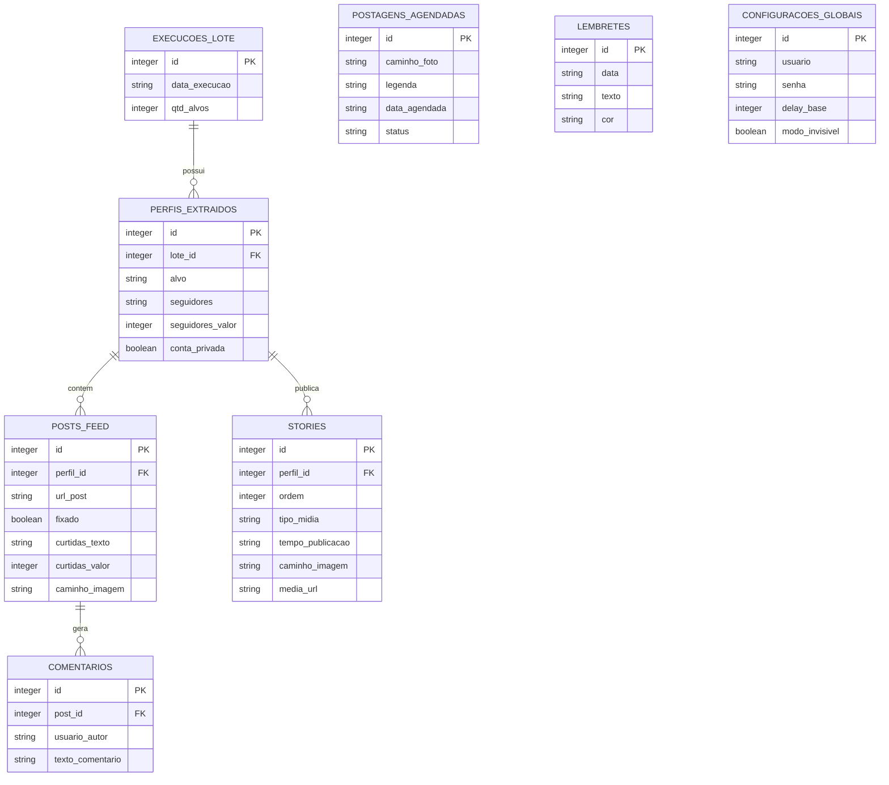

# Documentação Técnica: AutPost (Instagram Monitor Pro)

O AutPost é um sistema completo desenvolvido em Python para automação, monitoramento e extração de dados da plataforma Instagram. Esta documentação abrange o funcionamento interno, arquitetura, e estrutura do banco de dados para auxiliar no desenvolvimento contínuo e manutenção.

---

## 1. Arquitetura do Sistema

O sistema utiliza uma arquitetura modularizada em camadas, separando as responsabilidades de extração de dados, armazenamento, agendamento de tarefas e interface visual.

- **Frontend (Painel de Controle e Calendário):** Interface visual construída com HTML5 e estilizada com Tailwind CSS + Vanilla CSS. O Javascript foi **completamente refatorado em Módulos ES6** (`dashboard.js`, `scraper.js`, `modals.js`, `agendamentos.js`, `calendar.js`, `dragDrop.js`, `toast.js`, `ui.js`, `config.js`, `globals.js`, `lembretes.js`) orquestrados pelo arquivo `main.js`. Permite interações ricas como **Drag & Drop**, gestão do calendário de posts, acompanhamento ao vivo via polling e sistema de **Notificações Toast** não-obstrutivas. Utiliza **cache-busting por versão** (`?v=X.0`) nos imports para evitar problemas de cache agressivo do navegador.
- **Backend (API FastAPI):** O arquivo `main.py` hospeda o servidor Uvicorn. Provê todas as rotas RESTful para operação dos scripts, CRUD no banco de dados e arquivos estáticos. O backend **não executa tarefas pesadas sozinho**; ele delega essas operações para uma fila assíncrona.
- **Broker de Fila (Redis):** Servidor local na porta `6379` que recebe os comandos da API (ex: "rodar_robo", "publicar_no_instagram") e organiza a fila de execução.
- **Trabalhadores em Segundo Plano (Celery Workers):** Processos paralelos que rodam de forma totalmente independente da API. O `celery_app.py` consome a fila do Redis e aciona os arquivos em `tasks/` (`bot_tasks.py` e `post_tasks.py`). Isso impede que lentidões do Selenium interfiram no carregamento do site.
- **Motores de Automação (Selenium):** Scripts pesados executados exclusivamente pelos Celery Workers:
  - `scraper.py` e `scraper_stories.py` (com **deduplicação inteligente** e tolerância a falhas).
  - `ig_poster_selenium.py` (fluxo de publicação UI completa, suporte a carrossel e logs salvos no DB a cada passo).
- **Gerenciador de Agendamentos (O Vigia do APScheduler):** Rodando junto da API, ele acorda a cada minuto, varre o BD por posts "PENDENTES" vencidos e despacha as ordens para a fila do Celery.

---

## 2. Módulos e Funcionalidades

### main.py (A Porta de Entrada)
Ponto de conexão que Inicia a FastAPI, carrega middlewares CORS e hospeda o APScheduler.
- **Delegação de Tarefas:** Rotas pesadas (`/executar_bot`, `/api/publicar_agora`) apenas despacham ordens para a Fila (`.delay()`) e retornam imediatamente o `task_id` ao frontend.
- **Status em Tempo Real:** A rota `/api/status_tarefa/{task_id}` monitora diretamente o Celery (`AsyncResult.state`), atualizando entre "PROGRESS" > "SUCESSO"/"ERRO" dinamicamente.
- Servir arquivos estáticos (`/fotos`, `/uploads`, `/frontend-react/dist`).
- **Rotas analíticas:** `/api/perfis`, `/api/historico_graficos`, `/api/stories/{perfil}`, `/api/historico_detalhado/{perfil}`.

### scraper.py (Extração do Feed)
Funções baseadas em Selenium WebDriver.
- **rodar_robo**: Orquestra toda a extração (Login → Acessar Alvo → Extrair Perfil → Seguidores → Posts → Curtidas/Comentários).
- **Proteção de RAM (aniquilar_processo_chrome)**: Destrói processos filhos do Chrome que falham ao encerrar.
- **Limitações de Segurança:** Configurável via interface (limite de posts, tempos de espera, modo headless).

### scraper_stories.py (Extração de Stories)
Módulo dedicado à captura de stories com deduplicação.
- **_extrair_media_url**: Extrai a URL da mídia (`src` da `` ou `<video>`) do DOM como identificador único.
- **_capturar_print_story**: Localiza o elemento de mídia no DOM e faz screenshot isolado.
- **extrair_stories_perfil**: Orquestra a extração percorrendo todos os stories ativos. Antes de capturar, consulta `buscar_print_story_existente()` no banco. Se o print já existe, reutiliza o arquivo sem criar duplicata.
- **Logs descritivos:** Exibe no terminal `♻️ Reutilizando print existente` ou `📸 Novo print capturado`.

### database.py (Camada de Dados)
Implementado em SQLite3 com `PRAGMA foreign_keys = ON`.
- `conectar()`: Context Manager seguro para conexões.
- `buscar_todos_perfis()`: Retorna todos os perfis únicos já extraídos (alimenta o dropdown dinâmico do dashboard).
- `buscar_stories_por_perfil()`: Deduplicação inteligente por `media_url` (GROUP BY). Stories legado (sem `media_url`) retornam apenas da extração mais recente. Inclui campo `vezes_visto` contando capturas.
- `buscar_print_story_existente()`: Verifica se já existe um print para uma `media_url`, incluindo checagem de existência do arquivo no disco.
- `obter_ranking_horarios()`: Análise de dias da semana com maior engajamento.
- `inserir_log_postagem()` / `buscar_logs_postagem()`: Gerencia os logs detalhados de cada tentativa de publicação via Selenium.

### ig_poster_selenium.py (Automação de Postagem)
Módulo que utiliza Selenium para interagir frontalmente com o Instagram.
- **Fluxo de Publicação:** Realiza login automático, lida com pop-ups de segurança, acessa o modal de criação e injeta mídias via input direto.
- **Suporte a Carrossel:** Permite o envio de múltiplas imagens separadas por quebra de linha, que o Chrome interpreta como multi-upload.
- **Logs de Depuração:** Cada etapa (clique, upload, erro) é registrada no banco de dados, permitindo que o frontend exiba o progresso ao vivo para o usuário.
- **Limpeza de Processos:** Implementa a função `_aniquilar_chrome` para garantir que instâncias do navegador não fiquem órfãs em caso de falha.

### Frontend JS (Módulos ES6)

| Arquivo | Responsabilidade |
|---|---|
| `main.js` | Ponto de entrada, orquestra imports com cache-busting |
| `dashboard.js` | Dashboard de crescimento, gráficos, galeria de stories/posts e **dropdown dinâmico de perfis** extraídos do banco |
| `scraper.js` | Interface da extração em tempo real, cards de resultado |
| `modals.js` | Sistema de modais customizados para agendamento, confirmações e rascunhos |
| `agendamentos.js` | Gestão de posts, **polling de logs de postagem** e integração com o motor Selenium |
| `calendar.js` | Calendário de conteúdo com **otimização de renderização (ícones sem sobreposição)** |
| `dragDrop.js` | Drag & Drop de agendamentos e lembretes |
| `toast.js` | Notificações toast (sucesso/erro/info) |
| `ui.js` | Navegação de abas, UI geral |
| `config.js` | Configurações globais |
| `globals.js` | Constantes, utilitários de data |
| `lembretes.js` | CRUD de lembretes |

### meta_api.py (Integrações Externas)
Conector com a API Graph do Facebook/Instagram (v19.0).
- Publicação em duas fases (Container Request → Publish Request).
- Modo Simulação quando não há Super Token válido.

### utils.py (Ferramentas Menores)
- **analisar_curtidas(texto)**: Converte textos do Instagram ("1,5 mi", "240 mil") em valores numéricos.
- **sleep_seguro()**: Sleep interruptível que permite cancelamento instantâneo.

---

## 3. Diagrama do Banco de Dados (Entidade-Relacionamento)

O banco de dados (SQLite `banco_dados.db`) utiliza relações com exclusão em cascata (`ON DELETE CASCADE`).



---

## 4. Fluxograma de Execução (Modo Assíncrono Celery + Redis)

1. Usuário configura credenciais na aba "Configurações Globais".
2. **Requisição:** Usuário clica em "Iniciar", mandando payload pro backend (`main.py`).
3. **Delegação:** A API joga a tarefa pra fila do **Redis** e devolve um HTTP 202 ("Recebido") com o `task_id` gerado pelo Celery.
4. **Polling:** A UI do React reage ao 202 ligando o aviso de load e faz polling `/api/status_tarefa/{task_id}` à cada 1s.
5. **Execução Isolada:** O processo separadado do **Celery Worker** pesca a `task` na fila, abre o Selenium em background, processa a tarefa pesada e salva o resultado via `database.salvar_lote()`. 
6. **Desbloqueio Constante:** Graças ao status na Fila, o painel Front-End nunca trava.
7. Backend avisa `"SUCCESS"`; a UI destrava sozinha, limpando o cache e puxando os novos dados.

---

## 5. Deduplicação de Stories

O sistema implementa deduplicação inteligente de screenshots para evitar acúmulo de arquivos repetidos:

```
Story exibido no navegador
    ↓
Extrai a URL da mídia (src da  ou <video>)
    ↓
Consulta o banco: "Já existe um print com essa media_url?"
    ├─ SIM → Reutiliza o caminho_imagem existente (sem novo screenshot)
    └─ NÃO → Tira o screenshot normalmente e salva
    ↓
Salva no banco COM a media_url para futuras consultas
```

A galeria de stories exibe cada story **uma única vez**, com um badge "Nx visto" indicando quantas vezes foi capturado. Stories legados (antes da deduplicação) mostram apenas os da extração mais recente.

---

## 6. Como Inicializar a "Fábrica" de Processos

O sistema agora lida com 3 macro-serviços que foram orquestrados em um arquivo `start.bat` automático:

1. Requer-se a pasta **"redis"** acoplada no RootDir (com o aplicativo Windows Memurai/Redis);
2. Dando 2 cliques no `start.bat`, ele:
    - Builda o front-end React novo se houver alterações.
    - Sobe o terminal `Redis Server` (se detectado) escutando solicitações;
    - Sobe o terminal do **Celery Worker AutInsta**, ativando ativamente as libs do VENV Python no background.
    - Sobe a instância final FastAPI principal para acesso Web.

## 7. Como Contribuir e Modificar

- **Adicionar Coluna Nova de Raspagem:** Adicione o extrator XPath no `scraper.py` ou `scraper_stories.py`. Inclua ao dicionário retornado e ao insert SQL no `database.py`. Use `ALTER TABLE` com `try/except` na `criar_tabelas()` para migração automática.
- **Configurar Novas Tarefas Celery:** Adicione nova classe `@celery_app.task` na pasta `/tasks/`, depois lembre-se de importar o módulo no `core/celery_app.py` > `include=['tasks.sua_nova_pasta']`.
- **Modificar Frontend:** Edite as View Models em `frontend-react/`. Rode npm build pelo `.bat`.
- **Adicionar Novo Perfil:** Perfis são adicionados automaticamente ao banco na primeira extração e aparecem no dropdown do dashboard via `/api/perfis`.
